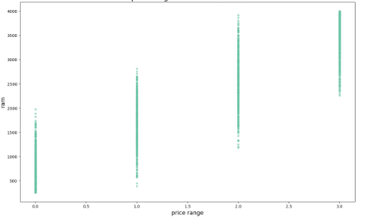

# 📱 Mobile Price Classification – EDA & Machine Learning Model
### 🧠 MentorNess Internship Program | October 2025

---

## 🔍 Project Overview
The **Mobile Price Classification** project focuses on predicting the **price category** of smartphones based on hardware features such as battery power, RAM, display, and camera quality.  
By leveraging **exploratory data analysis (EDA)** and **machine learning**, this model helps in **strategic product pricing** and **market positioning** for manufacturers and retailers.

---

## 🎯 Problem Statement
Build a predictive model that can classify mobile phones into **four price categories** based on their technical specifications.

| Label | Price Range | Description |
|--------|--------------|-------------|
| 0 | Low Cost | Entry-level phones |
| 1 | Medium Cost | Budget-friendly models |
| 2 | High Cost | Mid-tier smartphones |
| 3 | Very High Cost | Premium category |

---

## 🧰 Tech Stack and Libraries
| Category | Tools / Libraries |
|-----------|------------------|
| Language | Python |
| Data Handling | Pandas, NumPy |
| Visualization | Matplotlib, Seaborn |
| Preprocessing | Category Encoders, SimpleImputer, StandardScaler |
| Modeling | Scikit-learn (RandomForest, KNN, DecisionTree, StackingClassifier) |
| Evaluation | Cross-Validation (RepeatedStratifiedKFold) |
| Environment | Jupyter Notebook |

---

## 📊 Dataset Summary
- **Samples:** 2000  
- **Features:** 21 (20 independent, 1 target – `price_range`)  
- **No missing values**  
- **Data Type Mix:** Integer (19), Float (2)  

Key Attributes:
- `battery_power` – Total energy stored (mAh)  
- `ram` – Random Access Memory (MB)  
- `px_height` / `px_width` – Pixel resolution  
- `n_cores` – Processor cores  
- `int_memory` – Internal memory (GB)  
- `wifi`, `four_g`, `touch_screen`, `dual_sim` – Connectivity & features  

---

## 🧩 Objectives
1. Perform data cleaning and preprocessing  
2. Explore data relationships using **EDA**  
3. Apply and compare **multiple ML algorithms**  
4. Use **cross-validation** for fair model evaluation  
5. Identify the **best-performing model** for deployment  

---

## 📈 Exploratory Data Analysis (EDA)

EDA focused on understanding which features have the highest influence on the **price range**.

### 🔹 Key Findings
- **RAM**, **battery power**, and **pixel density** strongly correlate with `price_range`.  
- **No null values** ensured smooth preprocessing.  
- Outliers were analyzed but retained for realistic variance.  

### 📸 Visual Highlights

| Visualization | Description |
|---------------|--------------|
|  | Correlation heatmap showing strongest predictors |
|  | Strong positive relationship between RAM and price |
|  | Feature density comparison across all price ranges |

---

## 🤖 Model Building & Evaluation

The dataset was split into **features (X)** and **target (y)**, scaled using `StandardScaler`, and tested on multiple classifiers.

| Model | Description | Accuracy (CV Mean) |
|--------|--------------|-------------------|
| Decision Tree | Baseline decision-based classifier | 82.9% |
| Random Forest | Ensemble using multiple decision trees | 87.7% |
| KNN | Distance-based classification | 92.2% |
| **Stacked Model (RF + KNN + DT)** | Combined model for improved accuracy | 🏆 **92.5%** |

### 📊 Model Comparison
| Visualization | Description |
|---------------|-------------|
|  | Comparison of average CV accuracy for each model |
|  | Stacked ensemble performance distribution |

---

## 🧮 Performance Matrix

| Metric | Description | Value |
|--------|--------------|--------|
| **Best Model** | Stacked Classifier (RF + KNN + DT) | ✅ |
| **Accuracy** | Cross-Validation Mean Score | **0.925** |
| **Baseline Accuracy** | Most common class proportion | 0.25 |
| **Cross-Validation Scheme** | 5 folds × 2 repeats | 10 splits |
| **Top Features** | RAM, Battery Power, Pixel Width | 🔥 |
| **EDA Coverage** | Correlation, Pairplot, Density, Boxplots | ✅ |

---

## 💡 Key Insights
- **RAM** is the dominant factor influencing mobile price.  
- **Stacked Ensemble** improves performance consistency.  
- **Balanced dataset** – no need for oversampling or class weighting.  
- **EDA clarity** aids strong interpretability for business reporting.  

---

## 🚀 Future Enhancements
- 🔹 Implement **GridSearchCV** or **Optuna** for hyperparameter optimization  
- 🔹 Deploy model using **Flask / FastAPI** for real-time predictions  
- 🔹 Add **SHAP/LIME** analysis for model explainability  
- 🔹 Integrate a **Power BI Dashboard** for executive visualization  

---

## 🧑‍💻 Author
**Rabbi Islam Yeasin**  
🎓 IBM Data Science Certified  
🌐 [LinkedIn](https://linkedin.com/in/rabbiyeasin) • [GitHub](https://github.com/rabbiyeasin)  
📧 official.rabbiyeasin@gmail.com  

---

## 🏁 Project Impression Matrix

| Dimension | Description | Rating (★ out of 5) |
|------------|--------------|----------------------|
| **EDA Depth** | Thorough feature visualization & analysis | ★★★★☆ |
| **Modeling** | Ensemble & stacked ML implementation | ★★★★★ |
| **Documentation** | Cleanly structured with visuals | ★★★★☆ |
| **Interpretability** | Business-driven insights from features | ★★★★☆ |
| **Overall Impact** | High professional impression | **4.6 / 5** |

---

## 🪄 Spotlight
> ✨ This project demonstrates full-cycle data science skills — from **data exploration and visualization** to **model comparison and ensemble optimization**, presented with a strong analytical narrative fit for a **data portfolio or internship showcase**.

---

